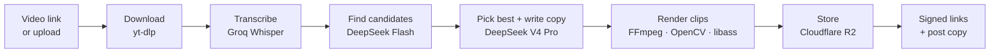
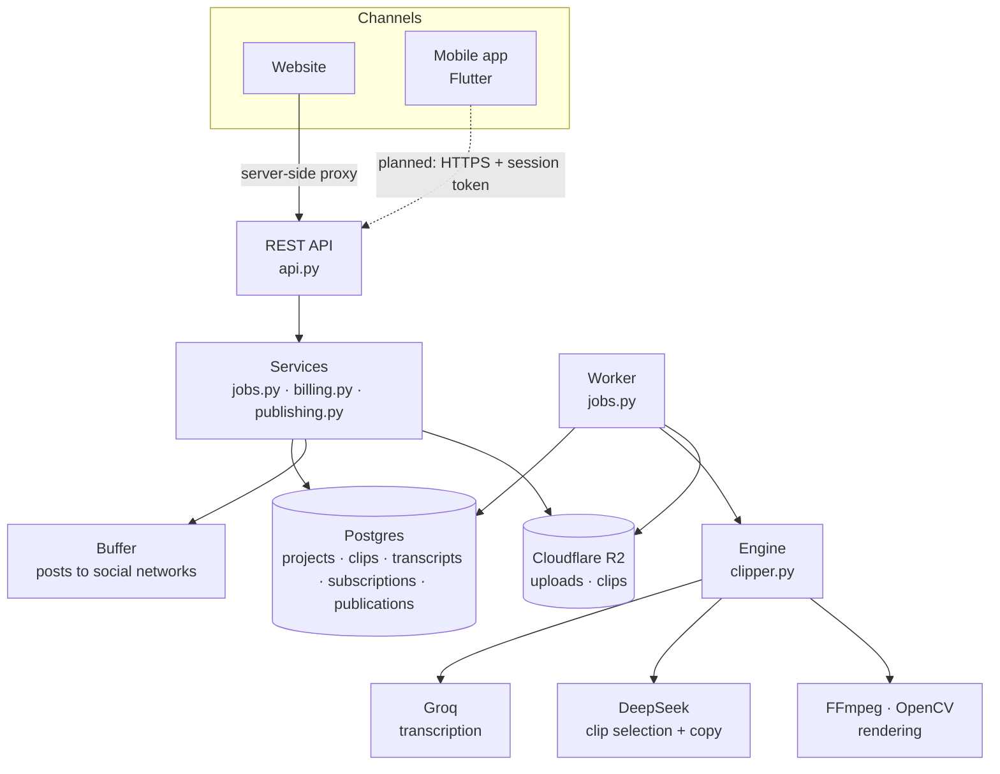

# YT-Clipper

**Turn one long video into weeks of short-form content.**

Give YT-Clipper a podcast, interview or talk (a link or an uploaded file). It listens to the whole thing, finds the
moments that work on their own, and turns each one into a vertical 9:16 clip: the speaker kept in frame, captions
that highlight each word as it's spoken (or no new captions, for videos that already have subtitles), a hook line,
a thumbnail, and ready-to-post copy written separately
for TikTok, Instagram, YouTube Shorts, LinkedIn, Facebook and X.

The guiding principle: **AI makes the decisions, proven software does the work.** Language models choose the moments
and write the copy; FFmpeg, OpenCV and libass do the cutting, cropping and captioning. That keeps output accurate
(caption text always comes from the real transcript) and costs low.

> **Status:** the backend (engine, job system, storage, billing, publishing, payments) is built, tested and
> **deployed on Railway**; the website is **deployed on Vercel** from `main`: submit one or many videos, follow
> progress with the video's picture and a progress bar, review clips, download everything as a ZIP, publish or
> schedule approved clips through Buffer, spread them over a content calendar, and pay for a plan (prices in USD,
> charged in Naira through Paystack; each payment buys 30 days). Accounts use Clerk. The **Flutter mobile app**
> covers the same flows and has been built and tested, but not yet run on a phone. See
> [Status and roadmap](#status-and-roadmap).

---

## Contents

- [How it works](#how-it-works)
- [Ways to use YT-Clipper](#ways-to-use-yt-clipper)
- [Architecture](#architecture)
- [Repository layout](#repository-layout)
- [Getting started](#getting-started)
- [Configuration](#configuration)
- [Running the backend](#running-the-backend)
- [Running the website](#running-the-website)
- [API reference](#api-reference)
- [What you get back](#what-you-get-back)
- [Storage, retention and cleanup](#storage-retention-and-cleanup)
- [Reliability](#reliability)
- [Security](#security)
- [Costs](#costs)
- [Testing](#testing)
- [Troubleshooting](#troubleshooting)
- [Status and roadmap](#status-and-roadmap)
- [Documentation and licenses](#documentation-and-licenses)

---

## How it works



1. **Download.** Links are fetched with yt-dlp (H.264, up to 1080p, preferred because it decodes fast). Uploaded files
   go straight to object storage and are fetched from there.
2. **Transcribe.** The audio is sent to Groq's `whisper-large-v3-turbo` in 10-minute pieces that overlap by 10
   seconds, then stitched back together so no word is lost at a seam. Every word gets a start and end time.
   Transcripts are cached, so the same video is never paid for twice.
3. **Find candidates.** A fast, cheap model (`deepseek-flash`) reads the whole timestamped transcript and proposes
   moments that stand on their own: a strong opening, one complete thought, a clear payoff.
4. **Pick and write.** A stronger model (`deepseek-v4-pro`) reads only those candidates, picks the best ones and
   writes a hook, title, description, hashtags and a post for each platform. It can choose clips but never change
   their timestamps. Every model response is checked against a schema and retried if it's malformed.
5. **Render.** Each clip is:
   - cut on word boundaries (never mid-word),
   - reframed to 9:16 by detecting faces four times a second and holding a steady crop on the speaker
     (center crop if there's no face),
   - captioned in short groups of up to three words with the spoken word highlighted (skipped when the project turns
     captions off; the caption file is made either way). Nothing else is drawn over the video,
   - loudness-normalized for social platforms and encoded as 1080×1920 H.264,
   - given a thumbnail.
6. **Store.** The clips, captions, thumbnails and a `clips.json` summary are uploaded to Cloudflare R2 and handed back
   as private, time-limited download links.

---

## Ways to use YT-Clipper

One account, one subscription and one usage balance, reachable two ways:

| Channel | What it's for | Status |
|---|---|---|
| **Website** (`apps/website`) | The only place to **subscribe and pay**. Also the full product: submit videos, review clips, schedule posts, see usage. | Deployed on Vercel: submit (batch), progress, review, ZIP download, publish/schedule through Buffer, content calendar, pricing/checkout/billing with live payments (USD prices, Naira charge, 30 days per payment), comparison and tool pages |
| **Mobile app** (`apps/mobile`, Flutter, Android first) | The product on a phone: paste or share a link (YouTube's Share button), pick a video, follow progress, review, edit and approve clips, save or share them, publish now or schedule, content calendar, see usage. No purchases in the app; plans are managed on the website. | Built and tested (13 tests); not yet run on a device; iOS build route not set up |

Both are thin clients over the same backend. Sign-in, subscription checks and usage limits are enforced once, in the
backend, so the rules are identical in both. The backend's REST API is what the website runs on; it isn't offered as a
separate way to use YT-Clipper.

---

## Architecture



- **A modular monolith.** One Python backend, no microservices, no Redis. Postgres is both the database and the job
  queue.
- **Requests never wait for video work.** Creating a project returns immediately with an id; a separate worker process
  does the processing; clients check the status.
- **Business logic lives in the services**: `jobs.py` (projects, review, content package), `billing.py` (plans and
  usage limits) and `publishing.py` (sending approved clips to Buffer). The API and the worker call the same functions, so limits are
  identical for the website and the mobile app. The website never talks to the backend directly from the browser: its
  own server forwards `/api/*` requests with the signed-in session. The mobile app calls the API directly with its
  Clerk session token.
- **Hosting:** the backend runs on Railway as two services built from one `Dockerfile` (`api`, and `worker` with
  `START_COMMAND=python jobs.py`) plus Railway Postgres; media stays on Cloudflare R2. The website runs on Vercel and
  deploys on every push to `main`. The domain will be `ytclipper.xyz`.
- **Providers are swappable by configuration.** Groq and DeepSeek are both reached through the OpenAI-compatible SDK;
  R2 is reached through the standard S3 API, so any S3-compatible store works.

---

## Repository layout

```
ClipperAi/
├── README.md               this file
├── masterprompt.md         full product specification and phase plan
├── phase0.md               Phase 0 research checklist
├── DECISIONS.md            every component, its license, cost and why it was chosen
├── .claude/                instructions and build log for AI-assisted development
└── apps/
    ├── backend/            Python backend: engine, API, worker, billing
    │   ├── clipper.py      the engine (run by the worker)
    │   ├── jobs.py         project services + background worker
    │   ├── billing.py      plans, the subscription, monthly usage limits
    │   ├── publishing.py   publish and schedule approved clips through Buffer
    │   ├── api.py          REST API (FastAPI)
    │   ├── storage.py      Cloudflare R2 / S3: uploads, signed links, bucket setup
    │   ├── dev.py          run API + worker + fake S3 (and optionally a fake Buffer) locally in one command
    │   ├── fake_buffer.py  stand-in for Buffer's API, for tests and local development
    │   ├── db.py           Postgres connection + migration runner
    │   ├── migrations/     plain SQL migrations, applied in order
    │   ├── fonts/          Montserrat ExtraBold for captions (SIL OFL)
    │   ├── models/         YuNet face detection model (MIT)
    │   ├── test_clipper.py engine tests
    │   ├── test_jobs.py    job queue, storage, billing and publishing tests
    │   ├── dev_fixture.py  test data for the website walkthrough (local dev database only)
    │   ├── Dockerfile      one image for the Railway api and worker services (railway.json: build + restarts)
    │   ├── requirements.txt
    │   └── .env.example    configuration template
    ├── website/            Next.js website (Phase 5)
    │   ├── app/            pages: / (new project), /dashboard, /projects/[id], /projects/[id]/calendar, /pricing,
    │   │                   /checkout, /settings/billing, /settings/integrations, /compare/*, /tools/*, sitemap, robots
    │   ├── app/api/        server-side proxy that adds the backend key (the browser never sees it)
    │   ├── check.mjs       proxy checks against a running site
    │   ├── walkthrough.mjs clicks through every flow in headless Edge
    │   └── .env.example    BACKEND_URL + Clerk keys template
    └── mobile/             Flutter app (Android first): lib/api.dart (API client), lib/screens.dart (projects,
                            new project, clips, plan), lib/publish.dart (edit, publish, calendar), test/app_test.dart
```

Created locally while running, and never committed: `.env`, `.venv/`, `tmp/` (worker scratch space), `pgdata/` (local
development database), and in the website `.env.local`, `node_modules/`, `.next/`.

---

## Getting started

### Prerequisites

| Tool | Why | Install |
|---|---|---|
| **Python 3.12+** | Runs the backend | [python.org](https://www.python.org/downloads/) |
| **FFmpeg** (with libass) | Audio extraction, cutting, cropping, captions | Windows: `winget install Gyan.FFmpeg` · macOS: `brew install ffmpeg` · Debian/Ubuntu: `apt install ffmpeg` |
| **Node.js 20.9+** (or Deno for the backend only) | yt-dlp needs a JavaScript runtime to read YouTube; the website needs Node | [nodejs.org](https://nodejs.org/) or [deno.com](https://deno.com/) |
| **Groq API key** | Transcription | [console.groq.com](https://console.groq.com/) |
| **DeepSeek API key** | Clip selection and copywriting | [platform.deepseek.com](https://platform.deepseek.com/) |
| **Cloudflare R2 bucket** | Storing clips and uploads (API and worker only) | Cloudflare dashboard → R2 |

Check that `ffmpeg -version` and `ffprobe -version` work in a new terminal before continuing.

### Install

```bash
git clone https://github.com/HasbiyallahuJafaru/ClipperAi.git
cd ClipperAi/apps/backend

python -m venv .venv
# Windows PowerShell:  .venv\Scripts\Activate.ps1
# Windows Git Bash:    source .venv/Scripts/activate
# macOS / Linux:       source .venv/bin/activate

pip install -r requirements.txt
pip install pgserver "moto[server]"   # optional: local dev database + fake S3 for tests

cp .env.example .env                  # then open .env and fill it in
```

The website has its own install step; see [Running the website](#running-the-website).

### Set up the R2 bucket

1. In the Cloudflare dashboard, open **R2** and **create a bucket** (for example `clipperai-media`).
2. Under **R2 → Manage API tokens**, create a token with read and write access to that bucket. To let the setup
   command below apply cleanup rules, the token needs the *Workers R2 Storage Write* (admin) permission.
3. Put the endpoint, keys and bucket name in `.env` (see [Configuration](#configuration)).
4. Run once:

   ```bash
   python storage.py setup
   ```

   This tells R2 to delete uploads after 1 day, clips after 30 days and unfinished multi-part uploads after 1 day
   (replacing R2's default rule for those), and allows browsers to upload and play files through signed links.

5. **For publishing** (optional): create a second bucket (for example `clipperai-published`) and switch on public
   access in its settings (the `r2.dev` subdomain to start, your own domain before launch). Put its name and public
   address in `S3_PUBLIC_BUCKET` and `S3_PUBLIC_URL`, then run `python storage.py setup` again: copies left there are
   deleted after 45 days. Buffer can't read signed links, so each post gets its own copy of the clip in this bucket,
   deleted as soon as the post has gone out.

---

## Configuration

All settings live in `apps/backend/.env` (copy of [`.env.example`](apps/backend/.env.example)). Never commit this file.

| Variable | Needed by | Description |
|---|---|---|
| `GROQ_API_KEY` | worker | Groq key for transcription. |
| `DEEPSEEK_API_KEY` | worker | DeepSeek key for clip selection and copy. |
| `CLERK_SECRET_KEY` | API, fixture | Clerk secret key of the linked Clerk app. The API accepts only Clerk session tokens. Get it with `clerk env pull --file <a temporary file>` and copy just this line. |
| `CLERK_AUTHORIZED_PARTIES` | API | Site origins allowed to present session tokens, comma-separated. Default `http://127.0.0.1:3000,http://localhost:3000`. |
| `BUFFER_OWNERS` | API | Clerk user or organization ids allowed to publish through `BUFFER_API_KEY` (it posts to one person's social accounts). `dev.py --fake-buffer` sets `*`. |
| `DATABASE_URL` | API, worker | Postgres connection string. **Leave blank locally**: a development Postgres starts automatically in `apps/backend/pgdata` (requires `pgserver`) and keeps running between sessions. Set it in production. |
| `WORKER_CONCURRENCY` | worker | How many projects one worker processes at once. Default `1`. Each running project uses one FFmpeg process, so size this to the machine's CPU and memory. |
| `S3_ENDPOINT` | API, worker | For R2: `https://<ACCOUNT_ID>.r2.cloudflarestorage.com`. |
| `S3_ACCESS_KEY_ID` | API, worker | R2 API token access key. |
| `S3_SECRET_ACCESS_KEY` | API, worker | R2 API token secret. |
| `S3_BUCKET` | API, worker | Bucket name. |
| `S3_PUBLIC_BUCKET` | API | Publishing only: the public bucket that holds copies of clips being posted. |
| `S3_PUBLIC_URL` | API | Publishing only: that bucket's public address, e.g. `https://pub-<id>.r2.dev` or `https://media.example.com`. |
| `BUFFER_API_KEY` | API | Buffer API key for publishing (Buffer → Settings → API). Your social accounts are connected inside Buffer; YT-Clipper posts to them through this key. Optional: without it everything else works and the Publishing page says Buffer isn't connected. |

The website reads `apps/website/.env.local` (copy of [`.env.example`](apps/website/.env.example)), used only by its
server, never sent to the browser:

| Variable | Description |
|---|---|
| `BACKEND_URL` | Where the backend API runs, e.g. `http://127.0.0.1:8000`. |
| `NEXT_PUBLIC_CLERK_PUBLISHABLE_KEY`, `CLERK_SECRET_KEY` | Written by `clerk init` / `clerk env pull`. The secret key stays on the server. |
| `NEXT_PUBLIC_CLERK_SIGN_IN_URL`, `NEXT_PUBLIC_CLERK_SIGN_UP_URL` | `/sign-in` and `/sign-up`. |

---

## Running the backend

All commands run from `apps/backend` with the virtual environment active.

### Local development without Cloudflare

```bash
python dev.py
```

Starts everything in one process: the API on `http://127.0.0.1:8000`, one worker, the local database, and a fake
in-memory S3 server (moto) on port 9000 in place of R2. Only the Groq, DeepSeek and `CLERK_SECRET_KEY` settings are needed.
Stored clips disappear when you stop it. Needs `pip install pgserver "moto[server]"`.

`python dev.py --fake-buffer` also swaps Buffer for an in-memory stand-in with six demo channels, so publishing can be
tried without a Buffer account. (Real Buffer can't fetch videos from the fake S3 on your machine anyway: a real
publish needs R2.)

### API server and worker (with real R2)

Run these in two terminals:

```bash
python jobs.py                              # worker: picks up projects and processes them
python -m uvicorn api:app --port 8000       # REST API on http://127.0.0.1:8000
```

Both apply database migrations on start. You can run several workers (or raise `WORKER_CONCURRENCY`); they never
pick up the same project twice. Interactive API docs are at `http://127.0.0.1:8000/docs`.

---

## Running the website

The website (`apps/website`, Next.js + TypeScript + Tailwind) talks to the backend above, so start that first
(`python dev.py` is enough locally).

```bash
cd apps/website
npm install
clerk init --app <your Clerk app id>   # installs @clerk/nextjs and writes the Clerk keys to .env.local
npm run dev                    # http://localhost:3000  (or: npm run build && npm run start)
```

| Page | What it does |
|---|---|
| `/` | Paste video links (one per line for several) or upload files (several at once, drag and drop works), with optional clip count and length. Each video becomes its own project and starts right away. |
| `/dashboard` | All projects, newest first, with live status. |
| `/projects/new` | The same form as the home page. |
| `/projects/{id}` | Live progress while processing (you can leave and come back), then every clip with a video preview, hook, title, description, per-platform posts with copy buttons, downloads, and **Approve / Reject / Edit**, plus **Approve all** and **Download all** (a ZIP of every clip that isn't rejected). Approved clips get **Publish**: choose Buffer channels and post now or at a time, then follow each post (posting, scheduled, posted with a link, or why it failed) and unschedule. Cancel or delete the project from here. |
| `/settings/integrations` | Publishing: whether Buffer is connected, and which channels can take clips (and why others can't). |
| `/pricing` | The three plans and their monthly limits. |
| `/checkout?plan=pro` | Order summary: the USD price, the Naira amount at the live rate, then Paystack's payment page. |
| `/checkout/return` | Where Paystack sends you back; waits for the backend to confirm the payment. |
| `/settings/billing` | Current plan and its renewal date, this month's usage against its limits, change or cancel the plan, billing history. |

Accounts are [Clerk](https://clerk.com): sign in and sign up from the header (`/sign-in`, `/sign-up`). The home page
and pricing are public; every other page asks you to sign in. The browser only ever calls the website's own `/api/*`
routes; the website's server forwards them to the backend with the signed-in user's Clerk session token, and the
backend verifies it and shows only that account's projects, plan and posts (the active Clerk organization's when one
is selected). Uploads go from the browser straight to storage through the signed link.

> **Local only for now.** `npm run dev` and `npm run start` listen on `localhost` only (Next's `proxy.ts` forwards to
> `localhost` internally, so binding `127.0.0.1` breaks it). Publishing still goes through one Buffer account
> (`BUFFER_OWNERS`), so each account needs its own publishing connection before the site goes public.

---

## Finding your way around the code

The repo is mapped with [graphify](https://github.com/Graphify-Labs/graphify) (Apache-2.0), a local knowledge graph of
the code and docs, so you can ask where things are instead of reading whole files:

```bash
pip install --user graphifyy
graphify update .                                   # build or refresh the map (local, no AI calls, ~10 s)
graphify hook install                               # refresh it automatically after each commit and checkout
graphify query "where are posts sent to Buffer?"    # search
graphify explain "send_queued"                      # one function and what it connects to
```

The map lives in `graphify-out/` and isn't committed.

Every feature is finished the same way: tests that prove it, every relevant check passing (`test_clipper.py`,
`test_jobs.py`, the website build + `check.mjs` + `walkthrough.mjs`, and `flutter test` for the app), then
`graphify update .`.

---

## API reference

This is the backend the website runs on (for development and the website itself; people use YT-Clipper through the
website or the mobile app). Every request needs `Authorization: Bearer <Clerk session token>` and acts for that account. Bodies
and responses are JSON. The examples use a shell variable holding a session token: `export TOKEN=...` (a signed-in
page gets one with `await window.Clerk.session.getToken()`; tokens last about a minute).

| Method | Path | What it does | Success |
|---|---|---|---|
| `POST` | `/api/uploads` | Get a signed link to upload a video file | `201` |
| `POST` | `/api/projects` | Start processing a video | `202` |
| `GET` | `/api/projects?limit=50` | List recent projects (newest first, max 200) | `200` |
| `GET` | `/api/projects/{id}` | One project, including its clips and download links | `200` |
| `POST` | `/api/projects/{id}/cancel` | Cancel a queued or running project | `200` |
| `DELETE` | `/api/projects/{id}` | Delete a project that isn't processing, with its clips and files | `204` |
| `PATCH` | `/api/projects/{id}/clips/{idx}` | Review a clip: approve / reject it, edit its copy | `200` |
| `GET` | `/api/projects/{id}/package` | Download `content-package.zip` (see [Content package](#content-package)) | `200` |
| `GET` | `/api/billing` | Plans, the current plan, this month's usage and billing history | `200` |
| `POST` | `/api/billing/checkout` | Start a payment: `{"plan", "email"}` → Paystack page + the Naira amount | `201` |
| `GET` | `/api/billing/payments/{reference}` | One of my payments (for the return page's polling) | `200` |
| `POST` | `/api/payments/callback` | The provider's signed webhook (HMAC-SHA512 over the raw body); activates the plan once per reference | `200` |
| `POST` | `/api/billing/cancel` | End the current plan | `200` |
| `GET` | `/api/publishing/channels` | The social accounts connected in Buffer, and whether each can take clips | `200` |
| `POST` | `/api/projects/{id}/clips/{idx}/publish` | Post an approved clip to Buffer channels, now or at a time | `201` |
| `POST` | `/api/projects/{id}/calendar/plan` | Preview a content calendar: which approved clip goes out when | `200` |
| `POST` | `/api/projects/{id}/calendar` | Schedule that calendar on Buffer channels | `201` |
| `GET` | `/api/projects/{id}/publications` | The project's posts and their current state | `200` |
| `DELETE` | `/api/publications/{id}` | Unschedule a post, or clear a failed one | `204` |

Errors: `401` bad or missing key · `402` no plan, or this month's allowance is used up (the message says which) ·
`404` unknown project, clip or post · `409` cancelling a finished project, deleting one that's still processing (cancel
it first) or that has posts still waiting to go out (unschedule them first), packaging one with nothing to download,
cancelling when there's no plan, publishing a clip that isn't approved, has expired or is already on that channel, or
Buffer not connected · `422` invalid input (the response explains what's wrong) · `502` Buffer refused the key, hit its
request limit or couldn't be reached (the message says which and what to do).

### Process a video from a link

```bash
curl -X POST http://127.0.0.1:8000/api/projects \
  -H "Authorization: Bearer $TOKEN" -H "Content-Type: application/json" \
  -d '{"source": "https://youtu.be/VIDEO_ID", "clips": 10, "min_seconds": 30, "max_seconds": 60}'
```

| Field | Required | Rules |
|---|---|---|
| `source` | yes | A public `http(s)` link, or `upload:<id>` from an upload. Local paths, `localhost` and private network addresses are rejected. |
| `clips` | no | 1–30. Default: about one per 2 minutes of video. |
| `min_seconds`, `max_seconds` | no | 5–180, min ≤ max. Defaults 30 and 60. |
| `captions` | no | `true` (default) burns captions into the clips; `false` for videos that already have subtitles. The caption file is made either way. |

### Process an uploaded file

Uploads go directly from the client to storage, never through the API server.

```bash
# 1. Ask for an upload link (size in bytes, any video/* type, up to 5 GB)
curl -X POST http://127.0.0.1:8000/api/uploads \
  -H "Authorization: Bearer $TOKEN" -H "Content-Type: application/json" \
  -d '{"content_type": "video/mp4", "size": 734003200}'
# -> {"source": "upload:3f6c...", "upload_url": "https://...", "method": "PUT",
#     "headers": {"Content-Type": "video/mp4"}, "expires_in": 3600}

# 2. Upload the file within an hour, sending exactly that Content-Type
curl -X PUT "<upload_url>" -H "Content-Type: video/mp4" --upload-file podcast.mp4

# 3. Start the project with the returned source
curl -X POST http://127.0.0.1:8000/api/projects \
  -H "Authorization: Bearer $TOKEN" -H "Content-Type: application/json" \
  -d '{"source": "upload:3f6c..."}'
```

### Follow progress

Poll `GET /api/projects/{id}` every few seconds. `status` is for code, `message` is ready to show to people, and
`detail` adds context such as `clip 3 of 10`, or, for a project that failed for a reason people can act on, that reason
(for example *no speech found in the video*, or a plan limit). `progress` is how far along the project is (0–100,
`null` once failed or cancelled; the download reports its own percentage in `detail`), and `thumbnail` is the source
video's picture for YouTube links (`null` otherwise). The project list also returns `clip_count` for each project.

| `status` | `message` | Meaning |
|---|---|---|
| `queued` | Waiting to start... | Waiting for a worker. |
| `queued` | Hit a problem. Trying again shortly... | An attempt failed; retrying after a short wait (`error` says why). |
| `downloading` | Getting your video... | Fetching the source. |
| `transcribing` | Listening to your video... | Speech to text (skipped if cached). |
| `analyzing` | Finding your strongest moments... | Choosing clips and writing copy. |
| `rendering` | Creating your clips... | Cutting, framing and captioning. |
| `packaging` | Preparing your clips... | Uploading results to storage. |
| `completed` | Ready. | Clips and links are available. |
| `failed` | Something went wrong. | `detail` has the reason when people can act on it; `error` has the technical one. |
| `cancelled` | Cancelled. | Stopped on request. |

### Review a clip

```bash
curl -X PATCH http://127.0.0.1:8000/api/projects/<id>/clips/1 \
  -H "Authorization: Bearer $TOKEN" -H "Content-Type: application/json" \
  -d '{"review": "approved", "title": "A better title"}'
```

Send only what changes. `review` is `pending`, `approved` or `rejected`; `title` (1–300 characters), `description`
(up to 5,000), `hashtags` (up to 30), `hook` (up to 300) and `posts` (all six platforms) replace the generated copy.
The response is the updated clip, without download links.

### Content package

`GET /api/projects/{id}/package` streams `content-package.zip` with every clip that isn't rejected:

```
videos/clip01.mp4 ...     captions/clip01.ass ...     thumbnails/clip01.jpg ...
metadata/clips.csv        one row per clip: title, hook, description, hashtags, a column per platform, timing, score, review
metadata/clips.json       the same, with posts as an object
calendar.csv              once anything is scheduled or posted: one row per post (time in UTC, clip, network, status, link)
```

The metadata includes your edits. The files are read straight from storage, so the package is always current and takes
no extra space.

### Plans and limits

A project can only start with an active plan. Plans are paid through the ZoomGuru Payment API (Paystack
underneath): prices are shown in USD and charged in Naira at a live daily rate (last good rate kept as a fallback),
and **each payment buys 30 days** — nothing is stored about cards and nothing charges itself; near the end the plan
shows its renewal date and the customer pays again. A plan only ever activates from the provider's signed webhook
(verified once per payment reference); if the webhook is missed, the worker re-verifies pending payments after 15
minutes. Expired plans behave like cancelled ones.

| Plan | Price shown | Videos a month | Hours of video a month | Clips a month |
|---|---|---|---|---|
| Creator | $15 | 5 | 5 | 50 |
| Pro | $39 | 15 | 15 | 150 |
| Business | $99 | no limit | 50 | 500 |

Months are calendar months. Failed and cancelled projects don't use a video. Limits are checked when an upload link or
project is requested (`402`), and again by the worker before anything is paid for: a video longer than the minutes left,
or a plan that ran out while it was queued, fails with the reason in `detail`, and the clip count is capped to what's
left. Plans live in `apps/backend/billing.py`.

### Publishing

Clips are published through [Buffer](https://buffer.com). Connect your social accounts in Buffer, create an API key
there (Settings → API) and set it as `BUFFER_API_KEY`. YT-Clipper never asks for social passwords.

```bash
curl http://127.0.0.1:8000/api/publishing/channels -H "Authorization: Bearer $TOKEN"
# -> [{"id": "...", "service": "tiktok", "name": "yourhandle", "displayName": "Your Name",
#      "isDisconnected": false, "isLocked": false, "usable": true}, ...]

curl -X POST http://127.0.0.1:8000/api/projects/<id>/clips/1/publish \
  -H "Authorization: Bearer $TOKEN" -H "Content-Type: application/json" \
  -d '{"channels": ["<channel id>", "<channel id>"], "due_at": "2026-09-20T15:00:00Z"}'
# -> one publication per channel: {"id": "...", "service": "tiktok", "status": "scheduled", "due_at": ..., "error": null}
```

- **Only approved clips** whose files haven't expired can be published. Omit `due_at` to post straight away.
- **Each network gets its own post** (`twitter` channels get the X post), with what the network requires: YouTube
  (posted as a Short) uses the clip title (up to 100 characters) and the "People & Blogs" category, Instagram and
  Facebook post it as a reel, and TikTok and Instagram use the frame at 1 second as the cover. Channels on other
  networks (Pinterest, Threads, ...) aren't offered yet, and neither are **personal Instagram profiles**: Buffer only
  sends those a reminder to post by hand, so switch the account to a creator or business account (free, in
  Instagram's settings) and reconnect it in Buffer.
- **Posts can be scheduled up to 30 days ahead.** Buffer reads the video when the post is created and again when it
  goes out, and it can't read signed links, so each post gets its own copy of the clip in the public bucket, under a
  random name. The copy is deleted once the post has been sent, has failed or is unscheduled (the bucket's 45-day rule
  catches any left over). The clip must still have its files when you publish.
- **Status.** `status` follows Buffer: `sending`, `scheduled`, `sent` (with `external_link`), `error` (with the
  reason in `error`). When you fetch `/publications`, posts whose time has come are checked with Buffer (at most once a
  minute each, to stay within Buffer's limit of 100 requests per 15 minutes).
- **One post per clip per channel.** Posting the same clip to the same channel again is refused until the earlier post
  is unscheduled or has failed. If Buffer refuses one channel (say, its queue is full) the others still go out, and the
  refused one is recorded with Buffer's reason.

### Content calendar

Instead of publishing clips one by one, spread every approved clip over posting days and times ("Schedule all" on the
website):

```bash
curl -X POST http://127.0.0.1:8000/api/projects/<id>/calendar/plan \
  -H "Authorization: Bearer $TOKEN" -H "Content-Type: application/json" \
  -d '{"channels": ["<channel id>"], "days": [1, 3, 5], "times": ["09:00", "18:00"], "start": "2026-09-21",
       "timezone": "Europe/London"}'
# -> {"posts": [{"clip_idx": 1, "title": "...", "due_at": "2026-09-21T08:00:00Z"}, ...], "left": []}
```

| Field | Rules |
|---|---|
| `channels` | 1–20 Buffer channel ids that can take clips. Every clip goes to all of them. |
| `days` | Posting weekdays, `1` = Monday to `7` = Sunday. |
| `times` | 1–6 posting times on those days (`HH:MM`), in `timezone`. |
| `start` | First day posts can go out. |
| `timezone` | An IANA time zone name (the website sends the browser's). Daylight saving is followed. |

- **Which clips:** approved clips that aren't scheduled or posted yet, in clip order, one per posting time.
- **Which times:** from `start`, at least 30 minutes from now, up to 30 days ahead. Times one of the chosen channels
  already has a post at (from any project) are skipped, so a second calendar continues after the first. Clips that
  don't fit are listed in `left`.
- **Scheduling:** `POST /api/projects/{id}/calendar` with the same body creates the same plan and answers at once with
  one post per clip and channel, `status: "queued"`. The worker (`python jobs.py`) hands queued posts to Buffer one by
  one, usually within seconds, and they become `scheduled` like any other post. If Buffer's request limit is used up or
  Buffer is down, the worker waits a minute and tries again; a post that still isn't in Buffer by its time is marked
  `error`. If Buffer received a post but never answered, it is marked `error` rather than sent twice: check Buffer.
  Queued posts can be unscheduled like scheduled ones.

---

## What you get back

A completed project (abbreviated):

```json
{
  "id": "0b9c6c1e-5a7e-4a52-9f0e-3e1f6f0d2a11",
  "source": "https://youtu.be/VIDEO_ID",
  "status": "completed",
  "message": "Ready.",
  "files_expire_at": "2026-10-14T15:30:12Z",
  "clips": [
    {
      "idx": 1,
      "review": "pending",
      "start_s": 24.12,
      "end_s": 55.82,
      "score": 95,
      "hook": "They shoved a PC into this keyboard.",
      "title": "PC in a Keyboard",
      "description": "HP crammed a desktop-class PC with up to 64GB RAM into a 20.1mm keyboard.",
      "reason": "Surprising product with clear specs and a practical payoff.",
      "hashtags": ["#tech", "#pc", "#keyboard"],
      "posts": {
        "tiktok": "They shoved a PC into this keyboard 😳 Up to 64GB RAM... #tech #pc",
        "instagram": "...", "youtube": "...", "linkedin": "...", "facebook": "...",
        "x": "They shoved a PC into this keyboard. Up to 64GB RAM, 20.1mm thin. #tech"
      },
      "video_url": "https://<account>.r2.cloudflarestorage.com/...signed...",
      "captions_url": "https://...",
      "thumbnail_url": "https://..."
    }
  ]
}
```

| Field | Meaning |
|---|---|
| `review` | `pending` until someone approves or rejects the clip. |
| `start_s`, `end_s` | Where the clip sits in the original video, in seconds. |
| `score` | How strong the model judged the moment (0–100). Clips are ordered best first. |
| `hook` | A short opening line for the post or a voiceover (not drawn on the video). |
| `title`, `description`, `hashtags` | General copy for the clip. |
| `posts` | A separate post written for each platform's style and length. |
| `reason` | Why the moment was chosen. |
| `video_url` | 1080×1920 MP4, with captions burned in unless the project turned them off. Opening a link downloads the file; `<video>` tags still play it. |
| `captions_url` | The captions as an editable `.ass` subtitle file. |
| `thumbnail_url` | A JPEG cover image. |

Download links are valid for **24 hours**; fetch the project again for fresh ones. After `files_expire_at` (30 days)
the files are gone and no links are returned.

---

## Storage, retention and cleanup

YT-Clipper keeps media only as long as it's useful. Metadata (transcripts, clip details, copy) stays in Postgres.

| What | Where | Kept for |
|---|---|---|
| Uploaded source video | R2 `uploads/<id>` | Deleted as soon as its project finishes, fails or is cancelled. R2 removes any leftover after **1 day**. |
| Clips, captions, thumbnails, `clips.json` | R2 `projects/<project id>/` | **30 days** (deleted automatically by R2). |
| Copy of a clip being posted | Public bucket, `<post id>.mp4` | Until the post has gone out (or failed, or is unscheduled); R2 removes any leftover after **45 days**. |
| Downloaded video, audio chunks, render files | Worker's `tmp/<project id>/` | Deleted after every run, including failures. |
| Transcripts | Postgres `transcripts` | Kept, so the same video is never transcribed twice. |

Deletion after 1 and 30 days is enforced by R2 lifecycle rules (`python storage.py setup`), not by application code,
so it keeps working even if the backend is down. R2 removes expired objects within about 24 hours of expiry.

---

## Reliability

- **Retries.** Temporary failures (network errors, provider hiccups) are retried up to **3 attempts**, waiting 2 and
  then 4 minutes. Errors that retrying can't fix (a bad link, no speech, an invalid API key) fail immediately.
- **Crash recovery.** A running worker checks in every 30 seconds. If a worker dies, its project is automatically put
  back in the queue after 2 minutes and picked up again.
- **Cancellation.** Queued projects cancel instantly; running projects stop at their next step.
- **Provider resilience.** API calls to Groq and DeepSeek retry with backoff on rate limits and server errors; model
  output that doesn't match the expected format is rejected and requested again.
- **Bounded work.** Workers process a fixed number of projects at a time, and every FFmpeg run has a time limit, so a
  stuck encode can't block a worker forever.

---

## Security

- **Secrets stay in `.env`**, which is ignored by git. API keys are never sent to clients: the website's server adds
  the backend key when it forwards requests, and refuses requests coming from other sites.
- **Every API request is authenticated** with a Clerk session token, verified by the backend with Clerk's SDK, and
  every query is limited to the caller's account, so one account can't read or change another's projects, plans or
  posts. The website only listens on `localhost` while publishing still uses one Buffer account.
- **Usage limits are enforced in the backend**, not in the website, so no client can skip them.
- **No card data.** Payments happen on Paystack's hosted checkout; card details never touch YT-Clipper's servers,
  and amounts are fixed by the backend at checkout time.
- **Rate limits** on the backend (Redis when provided): 240 requests a minute per account, tighter on uploads
  (10/min), project starts (10/min) and checkout attempts (5/min); over the cap answers `429`.
- **Sources are validated** before any download: only public `http(s)` addresses or confirmed uploads. Local files,
  `localhost`, private networks and cloud metadata addresses are rejected.
- **Uploads are restricted** to video content types and 5 GB, and the file must actually exist in storage before a
  project is accepted.
- **Files are private.** They're only reachable through signed links that expire. The one exception is a clip you
  publish: it's copied to a separate public bucket under a random name for Buffer to fetch, and deleted once posted.
- **No social passwords.** Social accounts are connected inside Buffer; YT-Clipper only holds the Buffer API key, in
  `.env` on the server.
- **No shell injection.** External programs are run with argument lists, never by building shell command strings.
- **Licensing is checked.** Copyleft (GPL/AGPL) code is avoided in the product; see [DECISIONS.md](DECISIONS.md).

---

## Costs

Approximate API prices as of September 2026 (check providers for current rates):

| Service | Price | Notes |
|---|---|---|
| Groq `whisper-large-v3-turbo` | $0.04 per hour of audio | Free plan: 20 requests/min, 2 audio hours per hour, 8 per day. Upgrade before launch. |
| DeepSeek `deepseek-flash` | $0.15 / $0.60 per million input / output tokens (off-peak) | Candidate search over the full transcript. Peak prices are double. |
| DeepSeek `deepseek-v4-pro` | $0.66 / $1.98 per million input / output tokens (off-peak) | Final picks and copy, on candidates only. |
| Cloudflare R2 | $0.015 per GB-month, free downloads | First 10 GB free. |

In practice a one-hour video costs roughly **$0.04 for transcription and a few cents for the language models**; the
biggest cost is server time for rendering. Re-processing a video reuses its cached transcript.

---

## Testing

```bash
python test_clipper.py   # engine: cut snapping, model-output validation, clip selection, transcript stitching,
                         # audio chunk files, caption timing, face-tracking shots (needs ffmpeg)
python test_jobs.py      # jobs + storage + billing + publishing: queueing, retries and backoff, permanent failures,
                         # cancellation, crash recovery, uploads, signed links, expiry, cleanup, review, content
                         # package, plans, usage and limits, Buffer channels, post now / scheduled, per-network
                         # input, status checks, bad or revoked key, rate limit, refused and failed posts, unschedule
```

`test_jobs.py` starts a throwaway Postgres (`pgserver`), a fake S3 server (`moto`) and a fake Buffer
(`fake_buffer.py`), so it doesn't touch real data, your R2 bucket or your Buffer account. It needs internet access for
DNS checks. Both print `ok` when everything passes.

With the backend and website running, `node check.mjs` (from `apps/website`) checks the website's proxy: the key is
added, other sites are refused, backend errors and validation pass through, and every page loads. It makes no paid
calls.

The mobile app has its own checks: `flutter analyze` and `flutter test` (from `apps/mobile`) cover the API client,
uploads with progress, readable errors, the projects and project screens, clip editing, publishing, the calendar
request (with the phone's time zone) and project options.

`walkthrough.mjs` uses the site like a person in headless Microsoft Edge: refused without a plan, pricing → checkout →
plan, switching plans, several links and several uploaded files at once, approve, edit, copy, reject, **Download all**,
the Publishing page, **Publish** now and scheduled, unschedule, cancel plan. It needs the backend started with
`python dev.py --fake-buffer`, and it changes the local dev database, so it needs its fixture first:

```bash
cd apps/backend && python dev_fixture.py            # prints <project id> <media folder>; refuses if DATABASE_URL is set
cd apps/website && node walkthrough.mjs <project id> <media folder>
```

Screenshots are saved in your temp folder under `clipperai-walkthrough`.

---

## Troubleshooting

| Problem | Fix |
|---|---|
| `ffmpeg` / `ffprobe` not found | Install FFmpeg and open a new terminal so the updated PATH is picked up. |
| `missing GROQ_API_KEY, ...` | Fill in `apps/backend/.env` and save it. |
| API fails to start: `set CLERK_SECRET_KEY, S3_...` | The API needs `CLERK_SECRET_KEY` and all four `S3_*` settings. |
| YouTube: *"Sign in to confirm you're not a bot"* | YouTube blocks many server and cloud IP addresses. Upload the file instead, or run from a residential connection. |
| YouTube download finds no formats | Install Node.js or Deno; yt-dlp needs a JavaScript runtime for YouTube. |
| Upload `PUT` returns 403 | Send exactly the `Content-Type` you requested the upload link with, and upload within an hour. |
| `422 upload not found` | Finish the `PUT` before creating the project. |
| Download link returns an error | Links last 24 hours; request the project again. After 30 days the files are deleted. |
| Rendering is slow | Rendering is CPU-bound. Lower `WORKER_CONCURRENCY` on small machines, or run more worker machines. |
| Website: *"Can't reach the YT-Clipper backend"* | Start the backend (`python dev.py`) and check `BACKEND_URL` in `apps/website/.env.local`. |
| Website: *Sign in to continue.* while signed in | The backend couldn't verify the session: `CLERK_SECRET_KEY` in `apps/backend/.env` must belong to the same Clerk app as the website's keys, and the site's address must be in `CLERK_AUTHORIZED_PARTIES`. |
| Signed in, but pages act signed out (server log: *unable to resolve handshake*) | The website's server can't reach Clerk over HTTPS. Behind an HTTPS-scanning antivirus, start it with `NODE_EXTRA_CA_CERTS=<CA bundle>`; the backend needs `SSL_CERT_FILE=<CA bundle>`. |
| Locally, downloads over ~1–2 MB stall and reset (`RetriesExceededError`, `WinError 10054`), or yt-dlp says `CERTIFICATE_VERIFY_FAILED` | Antivirus web scanning (seen with Avast Web Shield) is intercepting the traffic, even on `127.0.0.1`. Add exceptions for `127.0.0.1`/`localhost` and HTTPS scanning, or pause it while testing. |
| `402 Choose a plan to start making clips.` | Pick a plan on `/pricing` and pay for 30 days. |
| Publishing: *"Buffer isn't connected yet"* / *"Buffer didn't accept the API key"* | Create a key in Buffer (Settings → API), put it in `BUFFER_API_KEY` and restart the API. |
| Publishing: *"Publishing isn't set up yet"* or Buffer says *"Video could not be read from its URL"* | Set up the public bucket (step 5 of [Set up the R2 bucket](#set-up-the-r2-bucket)) and check that `S3_PUBLIC_URL` opens a file in a private browser window. |
| Publishing: no channels to choose | Connect the social accounts in Buffer first; *Reconnect it in Buffer* means Buffer lost access to that account. |
| Instagram says *Needs an Instagram creator or business account* | Buffer can't post to personal Instagram profiles automatically. Switch it to a creator or business account in Instagram, then reconnect it in Buffer. |
| A post shows *Didn't post* | The reason comes from Buffer or the network. Dismiss it and publish again once it's fixed. If the video couldn't be fetched, check that storage is real R2 (not `dev.py`'s fake S3). |

---

## Status and roadmap

| Phase | What | Status |
|---|---|---|
| 0 | Research: components, licenses, costs ([DECISIONS.md](DECISIONS.md)) | ✅ Done |
| 1–2 | Clipping engine: transcription, two-pass selection, speaker framing, captions, thumbnails, per-platform copy | ✅ Done |
| 3 | Job system: REST API, Postgres queue, worker, retries, cancellation, crash recovery | ✅ Done |
| 4 | Storage: R2, direct uploads, signed links, automatic cleanup | ✅ Done: tested against a local S3 and checked live on R2 |
| 5 | Website: product UI, subscriptions and payments, usage | ✅ Deployed on Vercel: batch submit, progress, review, ZIP download, pricing/checkout/billing (live payments), SEO pages |
| 6 | Publishing through Buffer | ✅ Done: post now, scheduled and unscheduled posts tested through the website against real Buffer, YouTube and R2 |
| 7 | Content calendar and scheduling | ✅ Done: plan, preview, Schedule all through the worker, calendar list, `calendar.csv`; against real Buffer: one post scheduled and unscheduled through the website, and a 30-post batch (Buffer's request limit not yet tried for real) |
| 8 | Mobile app (Flutter, iOS + Android) on the same API | Built and tested on Android code; not yet run on a device; iOS build route and share extension to do |
| 9 | Accounts, plans, usage limits, cost tracking | Partly: plans and monthly limits for one workspace; accounts, real payments and cost tracking planned |
| 10 | Production hardening and deployment (Railway) | Partly: backend on Railway and website on Vercel; domain, Clerk production instance and hardening tests to do |

Known limitations today:

- Accounts use Clerk's development instance; a production instance and domain come with deployment. Publishing still
  runs through one Buffer account (`BUFFER_OWNERS`), so each account needs its own connection before a public launch.
- Payments are live but no real end-to-end purchase has been made yet, and the API key should be rotated before a
  public launch (it travelled through a chat).
- Publishing uses one Buffer account (the workspace's key), every YouTube upload gets the "People & Blogs" category,
  and the public bucket uses Cloudflare's rate-limited `r2.dev` address until a custom domain is connected.
- Buffer plans cap how many posts can be scheduled at once (10 on the account used for testing). Calendar posts past the
  cap come back as failed with Buffer's reason ("Scheduled posts limit reached"); the calendar doesn't warn beforehand.
- Captions can be switched off per project, but existing burned-in subtitles aren't detected automatically.
- Framing follows the largest face, which isn't always the person speaking in two-person shots; handheld footage can
  produce visible crop jumps.
- The thumbnail is taken 1 second into each clip, which can miss the speaker if the clip opens on other footage.
- **YouTube blocks downloads from Railway's servers** ("Sign in to confirm you're not a bot"): such projects fail
  with a readable message. Set `YTDLP_PROXY` on the worker to route downloads through a (residential) proxy; uploads
  always work.
- The live `.vercel.app` address is behind Vercel's Deployment Protection until it's switched to previews only or the
  domain is connected.

---

## Documentation and licenses

- [masterprompt.md](masterprompt.md): full product specification, principles and phase plan.
- [DECISIONS.md](DECISIONS.md): every dependency, its license, cost and the reason it was chosen.
- [.claude/](.claude/): working rules and the build log used for AI-assisted development.

Bundled third-party assets: **Montserrat** font (SIL Open Font License 1.1, see
[`apps/backend/fonts/OFL.txt`](apps/backend/fonts/OFL.txt); the website uses the same file for its headings) and the
**YuNet** face detection model (MIT,
[OpenCV Zoo](https://github.com/opencv/opencv_zoo)).

The YT-Clipper code itself doesn't have a license file yet.
