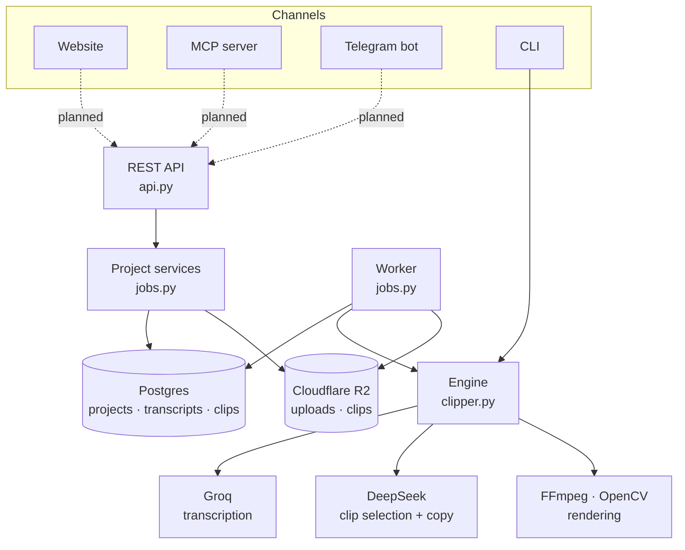

# ClipperAi

**Turn one long video into weeks of short-form content.**

Give ClipperAi a podcast, interview or talk (a link or an uploaded file). It listens to the whole thing, finds the
moments that work on their own, and turns each one into a vertical 9:16 clip: the speaker kept in frame, captions
that highlight each word as it's spoken, an on-screen hook, a thumbnail, and ready-to-post copy written separately
for TikTok, Instagram, YouTube Shorts, LinkedIn, Facebook and X.

The guiding principle: **AI makes the decisions, proven software does the work.** Language models choose the moments
and write the copy; FFmpeg, OpenCV and libass do the cutting, cropping and captioning. That keeps output accurate
(caption text always comes from the real transcript) and costs low.

> **Status:** the backend engine, job system and storage layer are built and tested. The website, publishing,
> MCP server, Telegram bot and billing are next. See [Status and roadmap](#status-and-roadmap).

---

## Contents

- [How it works](#how-it-works)
- [Ways to use ClipperAi](#ways-to-use-clipperai)
- [Architecture](#architecture)
- [Repository layout](#repository-layout)
- [Getting started](#getting-started)
- [Configuration](#configuration)
- [Running the backend](#running-the-backend)
- [API reference](#api-reference)
- [What you get back](#what-you-get-back)
- [Storage, retention and cleanup](#storage-retention-and-cleanup)
- [Reliability](#reliability)
- [Security](#security)
- [Costs](#costs)
- [Testing](#testing)
- [Troubleshooting](#troubleshooting)
- [Status and roadmap](#status-and-roadmap)
- [Documentation and licenses](#documentation-and-licenses)

---

## How it works


1. **Download.** Links are fetched with yt-dlp (H.264, up to 1080p, preferred because it decodes fast). Uploaded files
   go straight to object storage and are fetched from there.
2. **Transcribe.** The audio is sent to Groq's `whisper-large-v3-turbo` in 10-minute pieces that overlap by 10
   seconds, then stitched back together so no word is lost at a seam. Every word gets a start and end time.
   Transcripts are cached, so the same video is never paid for twice.
3. **Find candidates.** A fast, cheap model (`deepseek-flash`) reads the whole timestamped transcript and proposes
   moments that stand on their own: a strong opening, one complete thought, a clear payoff.
4. **Pick and write.** A stronger model (`deepseek-v4-pro`) reads only those candidates, picks the best ones and
   writes a hook, title, description, hashtags and a post for each platform. It can choose clips but never change
   their timestamps. Every model response is checked against a schema and retried if it's malformed.
5. **Render.** Each clip is:
   - cut on word boundaries (never mid-word),
   - reframed to 9:16 by detecting faces four times a second and holding a steady crop on the speaker
     (center crop if there's no face),
   - captioned in short groups of up to three words with the spoken word highlighted, plus the hook at the top for the
     first three seconds,
   - loudness-normalized for social platforms and encoded as 1080×1920 H.264,
   - given a thumbnail.
6. **Store.** The clips, captions, thumbnails and a `clips.json` summary are uploaded to Cloudflare R2 and handed back
   as private, time-limited download links.

---

## Ways to use ClipperAi

One account, one subscription and one usage balance, reachable three ways:

| Channel | What it's for | Status |
|---|---|---|
| **Website** (`apps/website`) | The only place to **subscribe and pay**. Also the full product: submit videos, review clips, schedule posts, see usage. | Planned (Phase 5) |
| **MCP server** | Use ClipperAi from AI assistants, e.g. *"take my latest podcast and make 15 clips"*. | Planned (Phase 8) |
| **Telegram bot** | Send a video link to a bot and get clips and post copy back. Linked to your website account. | Planned |

Every channel is a thin client over the same backend. Sign-in, subscription checks and usage limits are enforced once,
in the backend, so the rules are identical everywhere. Today the backend is used through its REST API and a
command-line tool.

---

## Architecture



- **A modular monolith.** One Python backend, no microservices, no Redis. Postgres is both the database and the job
  queue.
- **Requests never wait for video work.** Creating a project returns immediately with an id; a separate worker process
  does the processing; clients check the status.
- **Business logic lives in the services** (`jobs.py`). The API, the worker and the future MCP server and Telegram bot
  all call the same functions.
- **Providers are swappable by configuration.** Groq and DeepSeek are both reached through the OpenAI-compatible SDK;
  R2 is reached through the standard S3 API, so any S3-compatible store works.

---

## Repository layout

```
ClipperAi/
├── README.md               this file
├── masterprompt.md         full product specification and phase plan
├── phase0.md               Phase 0 research checklist
├── DECISIONS.md            every component, its license, cost and why it was chosen
├── .claude/                instructions and build log for AI-assisted development
└── apps/
    ├── backend/            Python backend (everything that exists today)
    │   ├── clipper.py      the engine + command-line tool
    │   ├── jobs.py         project services + background worker
    │   ├── api.py          REST API (FastAPI)
    │   ├── storage.py      Cloudflare R2 / S3: uploads, signed links, bucket setup
    │   ├── db.py           Postgres connection + migration runner
    │   ├── migrations/     plain SQL migrations, applied in order
    │   ├── fonts/          Montserrat ExtraBold for captions (SIL OFL)
    │   ├── models/         YuNet face detection model (MIT)
    │   ├── test_clipper.py engine tests
    │   ├── test_jobs.py    job queue + storage tests
    │   ├── requirements.txt
    │   └── .env.example    configuration template
    ├── website/            Next.js website (Phase 5)
    └── mcp/                MCP server (Phase 8; may live in the backend instead)
```

Created locally while running, and never committed: `.env`, `.venv/`, `work/` (CLI download and transcript cache),
`out/` (CLI output), `tmp/` (worker scratch space), `pgdata/` (local development database).

---

## Getting started

### Prerequisites

| Tool | Why | Install |
|---|---|---|
| **Python 3.12+** | Runs the backend | [python.org](https://www.python.org/downloads/) |
| **FFmpeg** (with libass) | Audio extraction, cutting, cropping, captions | Windows: `winget install Gyan.FFmpeg` · macOS: `brew install ffmpeg` · Debian/Ubuntu: `apt install ffmpeg` |
| **Node.js or Deno** | yt-dlp needs a JavaScript runtime to read YouTube | [nodejs.org](https://nodejs.org/) or [deno.com](https://deno.com/) |
| **Groq API key** | Transcription | [console.groq.com](https://console.groq.com/) |
| **DeepSeek API key** | Clip selection and copywriting | [platform.deepseek.com](https://platform.deepseek.com/) |
| **Cloudflare R2 bucket** | Storing clips and uploads (API and worker only) | Cloudflare dashboard → R2 |

Check that `ffmpeg -version` and `ffprobe -version` work in a new terminal before continuing.

### Install

```bash
git clone https://github.com/HasbiyallahuJafaru/ClipperAi.git
cd ClipperAi/apps/backend

python -m venv .venv
# Windows PowerShell:  .venv\Scripts\Activate.ps1
# Windows Git Bash:    source .venv/Scripts/activate
# macOS / Linux:       source .venv/bin/activate

pip install -r requirements.txt
pip install pgserver "moto[server]"   # optional: local dev database + fake S3 for tests

cp .env.example .env                  # then open .env and fill it in
```

### Set up the R2 bucket

1. In the Cloudflare dashboard, open **R2** and **create a bucket** (for example `clipperai-media`).
2. Under **R2 → Manage API tokens**, create a token with read and write access to that bucket. To let the setup
   command below apply cleanup rules, the token needs the *Workers R2 Storage Write* (admin) permission.
3. Put the endpoint, keys and bucket name in `.env` (see [Configuration](#configuration)).
4. Run once:

   ```bash
   python storage.py setup
   ```

   This tells R2 to delete uploads after 1 day and clips after 30 days, and allows browsers to upload and play files
   through signed links.

---

## Configuration

All settings live in `apps/backend/.env` (copy of [`.env.example`](apps/backend/.env.example)). Never commit this file.

| Variable | Needed by | Description |
|---|---|---|
| `GROQ_API_KEY` | CLI, worker | Groq key for transcription. |
| `DEEPSEEK_API_KEY` | CLI, worker | DeepSeek key for clip selection and copy. |
| `API_KEY` | API | Shared secret every API request must send as `Authorization: Bearer <API_KEY>`. Use a long random string, e.g. `python -c "import secrets; print(secrets.token_urlsafe(32))"`. Replaced by per-user accounts later. |
| `DATABASE_URL` | API, worker | Postgres connection string. **Leave blank locally**: a development Postgres starts automatically in `apps/backend/pgdata` (requires `pgserver`) and keeps running between sessions. Set it in production. |
| `WORKER_CONCURRENCY` | worker | How many projects one worker processes at once. Default `1`. Each running project uses one FFmpeg process, so size this to the machine's CPU and memory. |
| `S3_ENDPOINT` | API, worker | For R2: `https://<ACCOUNT_ID>.r2.cloudflarestorage.com`. |
| `S3_ACCESS_KEY_ID` | API, worker | R2 API token access key. |
| `S3_SECRET_ACCESS_KEY` | API, worker | R2 API token secret. |
| `S3_BUCKET` | API, worker | Bucket name. |
| `BUFFER_API_KEY` | — | Reserved for publishing (Phase 6); not used yet. |

The CLI only needs the Groq and DeepSeek keys; it doesn't use the database or R2.

---

## Running the backend

All commands run from `apps/backend` with the virtual environment active.

### Command-line tool (quickest way to try it)

```bash
python clipper.py "https://youtu.be/VIDEO_ID"
python clipper.py podcast.mp4 -n 5 --min 20 --max 45
```

| Option | Default | Meaning |
|---|---|---|
| `source` | — | A video link or a local video file. |
| `-n` | about 1 per 6 minutes of video (3–30) | Number of clips. |
| `--min`, `--max` | `30`, `60` | Target clip length in seconds. |
| `-o` | `out/<source id>/` | Output folder. |

Output goes to `out/<source id>/` (see [What you get back](#what-you-get-back)). Downloads and transcripts are cached
in `work/`, so re-running the same video skips straight to clip selection.

### API server and worker

Run these in two terminals:

```bash
python jobs.py                              # worker: picks up projects and processes them
python -m uvicorn api:app --port 8000       # REST API on http://127.0.0.1:8000
```

Both apply database migrations on start. You can run several workers (or raise `WORKER_CONCURRENCY`); they never
pick up the same project twice. Interactive API docs are at `http://127.0.0.1:8000/docs`.

---

## API reference

Every request needs `Authorization: Bearer <API_KEY>`. Bodies and responses are JSON. The examples use a shell
variable: `export API_KEY=...`.

| Method | Path | What it does | Success |
|---|---|---|---|
| `POST` | `/api/uploads` | Get a signed link to upload a video file | `201` |
| `POST` | `/api/projects` | Start processing a video | `202` |
| `GET` | `/api/projects?limit=50` | List recent projects (newest first, max 200) | `200` |
| `GET` | `/api/projects/{id}` | One project, including its clips and download links | `200` |
| `POST` | `/api/projects/{id}/cancel` | Cancel a queued or running project | `200` |

Errors: `401` bad or missing key · `404` unknown project · `409` cancelling a finished project · `422` invalid input
(the response explains what's wrong).

### Process a video from a link

```bash
curl -X POST http://127.0.0.1:8000/api/projects \
  -H "Authorization: Bearer $API_KEY" -H "Content-Type: application/json" \
  -d '{"source": "https://youtu.be/VIDEO_ID", "clips": 10, "min_seconds": 30, "max_seconds": 60}'
```

| Field | Required | Rules |
|---|---|---|
| `source` | yes | A public `http(s)` link, or `upload:<id>` from an upload. Local paths, `localhost` and private network addresses are rejected. |
| `clips` | no | 1–30. Default: about one per 6 minutes of video. |
| `min_seconds`, `max_seconds` | no | 5–180, min ≤ max. Defaults 30 and 60. |

### Process an uploaded file

Uploads go directly from the client to storage, never through the API server.

```bash
# 1. Ask for an upload link (size in bytes, any video/* type, up to 5 GB)
curl -X POST http://127.0.0.1:8000/api/uploads \
  -H "Authorization: Bearer $API_KEY" -H "Content-Type: application/json" \
  -d '{"content_type": "video/mp4", "size": 734003200}'
# -> {"source": "upload:3f6c...", "upload_url": "https://...", "method": "PUT",
#     "headers": {"Content-Type": "video/mp4"}, "expires_in": 3600}

# 2. Upload the file within an hour, sending exactly that Content-Type
curl -X PUT "<upload_url>" -H "Content-Type: video/mp4" --upload-file podcast.mp4

# 3. Start the project with the returned source
curl -X POST http://127.0.0.1:8000/api/projects \
  -H "Authorization: Bearer $API_KEY" -H "Content-Type: application/json" \
  -d '{"source": "upload:3f6c..."}'
```

### Follow progress

Poll `GET /api/projects/{id}` every few seconds. `status` is for code, `message` is ready to show to people, and
`detail` adds context such as `clip 3 of 10`.

| `status` | `message` | Meaning |
|---|---|---|
| `queued` | Waiting to start... | Waiting for a worker (or for a retry). |
| `downloading` | Getting your video... | Fetching the source. |
| `transcribing` | Listening to your video... | Speech to text (skipped if cached). |
| `analyzing` | Finding your strongest moments... | Choosing clips and writing copy. |
| `rendering` | Creating your clips... | Cutting, framing and captioning. |
| `packaging` | Preparing your clips... | Uploading results to storage. |
| `completed` | Ready. | Clips and links are available. |
| `failed` | Something went wrong. | See `error`. |
| `cancelled` | Cancelled. | Stopped on request. |

---

## What you get back

A completed project (abbreviated):

```json
{
  "id": "0b9c6c1e-5a7e-4a52-9f0e-3e1f6f0d2a11",
  "source": "https://youtu.be/VIDEO_ID",
  "status": "completed",
  "message": "Ready.",
  "files_expire_at": "2026-10-14T15:30:12Z",
  "clips": [
    {
      "idx": 1,
      "start_s": 24.12,
      "end_s": 55.82,
      "score": 95,
      "hook": "They shoved a PC into this keyboard.",
      "title": "PC in a Keyboard",
      "description": "HP crammed a desktop-class PC with up to 64GB RAM into a 20.1mm keyboard.",
      "reason": "Surprising product with clear specs and a practical payoff.",
      "hashtags": ["#tech", "#pc", "#keyboard"],
      "posts": {
        "tiktok": "They shoved a PC into this keyboard 😳 Up to 64GB RAM... #tech #pc",
        "instagram": "...", "youtube": "...", "linkedin": "...", "facebook": "...",
        "x": "They shoved a PC into this keyboard. Up to 64GB RAM, 20.1mm thin. #tech"
      },
      "video_url": "https://<account>.r2.cloudflarestorage.com/...signed...",
      "captions_url": "https://...",
      "thumbnail_url": "https://..."
    }
  ]
}
```

| Field | Meaning |
|---|---|
| `start_s`, `end_s` | Where the clip sits in the original video, in seconds. |
| `score` | How strong the model judged the moment (0–100). Clips are ordered best first. |
| `hook` | The line burned into the top of the video for the first 3 seconds. |
| `title`, `description`, `hashtags` | General copy for the clip. |
| `posts` | A separate post written for each platform's style and length. |
| `reason` | Why the moment was chosen. |
| `video_url` | 1080×1920 MP4 with captions burned in. |
| `captions_url` | The captions as an editable `.ass` subtitle file. |
| `thumbnail_url` | A JPEG cover image. |

Download links are valid for **24 hours**; fetch the project again for fresh ones. After `files_expire_at` (30 days)
the files are gone and no links are returned.

The CLI writes the same things to disk: `clip01.mp4`, `clip01.ass`, `clip01.jpg`, … and `clips.json`.

---

## Storage, retention and cleanup

ClipperAi keeps media only as long as it's useful. Metadata (transcripts, clip details, copy) stays in Postgres.

| What | Where | Kept for |
|---|---|---|
| Uploaded source video | R2 `uploads/<id>` | Deleted as soon as its project finishes, fails or is cancelled. R2 removes any leftover after **1 day**. |
| Clips, captions, thumbnails, `clips.json` | R2 `projects/<project id>/` | **30 days** (deleted automatically by R2). |
| Downloaded video, audio chunks, render files | Worker's `tmp/<project id>/` | Deleted after every run, including failures. |
| Transcripts | Postgres `transcripts` | Kept, so the same video is never transcribed twice. |

Deletion after 1 and 30 days is enforced by R2 lifecycle rules (`python storage.py setup`), not by application code,
so it keeps working even if the backend is down. R2 removes expired objects within about 24 hours of expiry.

---

## Reliability

- **Retries.** Temporary failures (network errors, provider hiccups) are retried up to **3 attempts**, waiting 2 and
  then 4 minutes. Errors that retrying can't fix (a bad link, no speech, an invalid API key) fail immediately.
- **Crash recovery.** A running worker checks in every 30 seconds. If a worker dies, its project is automatically put
  back in the queue after 2 minutes and picked up again.
- **Cancellation.** Queued projects cancel instantly; running projects stop at their next step.
- **Provider resilience.** API calls to Groq and DeepSeek retry with backoff on rate limits and server errors; model
  output that doesn't match the expected format is rejected and requested again.
- **Bounded work.** Workers process a fixed number of projects at a time, and every FFmpeg run has a time limit, so a
  stuck encode can't block a worker forever.

---

## Security

- **Secrets stay in `.env`**, which is ignored by git. API keys are never sent to clients.
- **Every API request is authenticated** with a bearer key (per-user accounts come with billing).
- **Sources are validated** before any download: only public `http(s)` addresses or confirmed uploads. Local files,
  `localhost`, private networks and cloud metadata addresses are rejected.
- **Uploads are restricted** to video content types and 5 GB, and the file must actually exist in storage before a
  project is accepted.
- **Files are private.** They're only reachable through signed links that expire.
- **No shell injection.** External programs are run with argument lists, never by building shell command strings.
- **Licensing is checked.** Copyleft (GPL/AGPL) code is avoided in the product; see [DECISIONS.md](DECISIONS.md).

---

## Costs

Approximate API prices as of September 2026 (check providers for current rates):

| Service | Price | Notes |
|---|---|---|
| Groq `whisper-large-v3-turbo` | $0.04 per hour of audio | Free plan: 20 requests/min, 2 audio hours per hour, 8 per day. Upgrade before launch. |
| DeepSeek `deepseek-flash` | $0.15 / $0.60 per million input / output tokens (off-peak) | Candidate search over the full transcript. Peak prices are double. |
| DeepSeek `deepseek-v4-pro` | $0.66 / $1.98 per million input / output tokens (off-peak) | Final picks and copy, on candidates only. |
| Cloudflare R2 | $0.015 per GB-month, free downloads | First 10 GB free. |

In practice a one-hour video costs roughly **$0.04 for transcription and a few cents for the language models**; the
biggest cost is server time for rendering. Re-processing a video reuses its cached transcript.

---

## Testing

```bash
python test_clipper.py   # engine: cut snapping, model-output validation, clip selection, transcript stitching,
                         # audio chunk files, caption timing, face-tracking shots (needs ffmpeg)
python test_jobs.py      # jobs + storage: queueing, retries and backoff, permanent failures, cancellation,
                         # crash recovery, uploads, signed links, expiry, cleanup
```

`test_jobs.py` starts a throwaway Postgres (`pgserver`) and a fake S3 server (`moto`), so it doesn't touch real data or
your R2 bucket. It needs internet access for DNS checks. Both print `ok` when everything passes.

---

## Troubleshooting

| Problem | Fix |
|---|---|
| `ffmpeg` / `ffprobe` not found | Install FFmpeg and open a new terminal so the updated PATH is picked up. |
| `missing GROQ_API_KEY, ...` | Fill in `apps/backend/.env` and save it. |
| API fails to start: `set API_KEY, S3_...` | The API needs `API_KEY` and all four `S3_*` settings. |
| YouTube: *"Sign in to confirm you're not a bot"* | YouTube blocks many server and cloud IP addresses. Upload the file instead, or run from a residential connection. |
| YouTube download finds no formats | Install Node.js or Deno; yt-dlp needs a JavaScript runtime for YouTube. |
| Upload `PUT` returns 403 | Send exactly the `Content-Type` you requested the upload link with, and upload within an hour. |
| `422 upload not found` | Finish the `PUT` before creating the project. |
| Download link returns an error | Links last 24 hours; request the project again. After 30 days the files are deleted. |
| Rendering is slow | Rendering is CPU-bound. Lower `WORKER_CONCURRENCY` on small machines, or run more worker machines. |

---

## Status and roadmap

| Phase | What | Status |
|---|---|---|
| 0 | Research: components, licenses, costs ([DECISIONS.md](DECISIONS.md)) | ✅ Done |
| 1–2 | Clipping engine: transcription, two-pass selection, speaker framing, captions, thumbnails, per-platform copy | ✅ Done |
| 3 | Job system: REST API, Postgres queue, worker, retries, cancellation, crash recovery | ✅ Done |
| 4 | Storage: R2, direct uploads, signed links, automatic cleanup | ✅ Built and tested against a local S3; live R2 test pending |
| 5 | Website: product UI, subscriptions and payments, usage | Next |
| 6 | Publishing through Buffer | Planned |
| 7 | Content calendar and scheduling | Planned |
| 8 | MCP server for AI assistants | Planned |
| — | Telegram bot | Planned |
| 9 | Accounts, plans, usage limits, cost tracking | Planned |
| 10 | Production hardening and deployment (Railway) | Planned |

Known limitations today:

- There's one shared API key; per-user accounts arrive with billing.
- Framing follows the largest face, which isn't always the person speaking in two-person shots; handheld footage can
  produce visible crop jumps.
- The thumbnail is taken 1 second into each clip, which can miss the speaker if the clip opens on other footage.
- Downloads from YouTube can be blocked on cloud servers; uploads are the reliable path.

---

## Documentation and licenses

- [masterprompt.md](masterprompt.md): full product specification, principles and phase plan.
- [DECISIONS.md](DECISIONS.md): every dependency, its license, cost and the reason it was chosen.
- [.claude/](.claude/): working rules and the build log used for AI-assisted development.

Bundled third-party assets: **Montserrat** font (SIL Open Font License 1.1, see
[`apps/backend/fonts/OFL.txt`](apps/backend/fonts/OFL.txt)) and the **YuNet** face detection model (MIT,
[OpenCV Zoo](https://github.com/opencv/opencv_zoo)).

The ClipperAi code itself doesn't have a license file yet.
